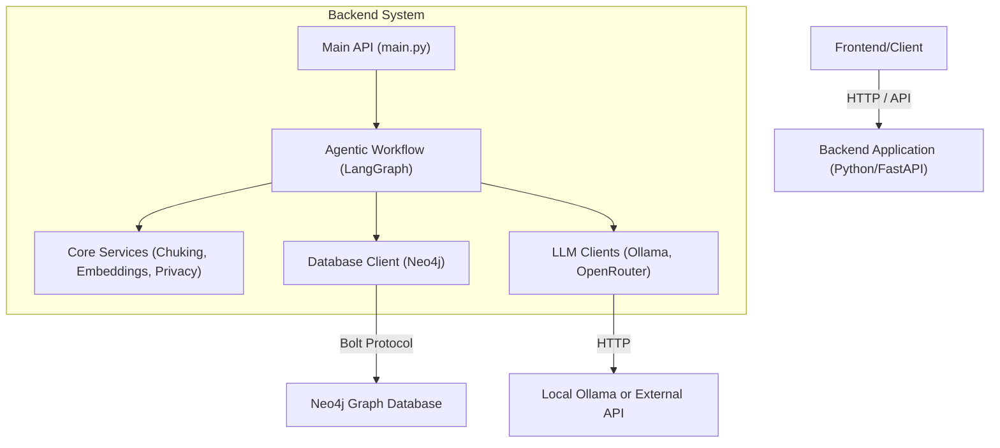
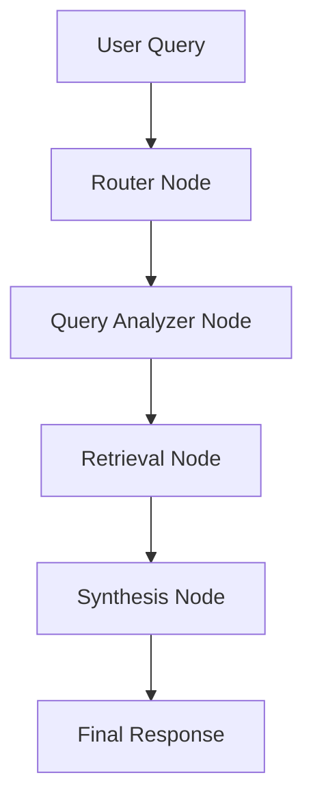
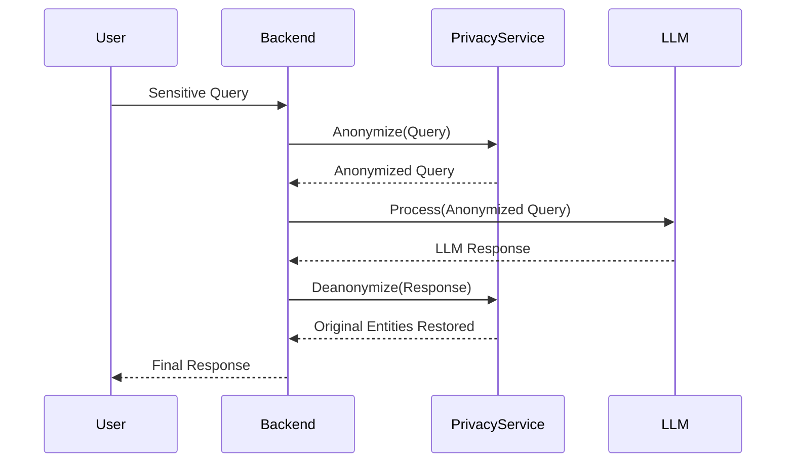

# System Architecture

## Overview
Parrot is composed of a backend processing engine, a graph database, and an LLM service.

## High-Level Architecture

## Agent Workflow

## Data Privacy & Anonymization

